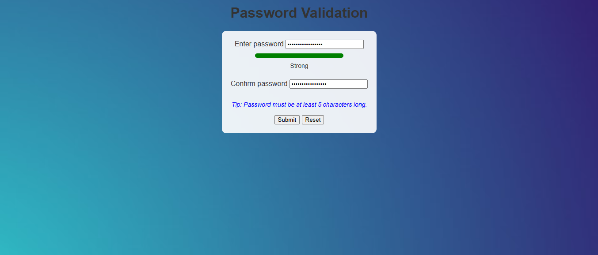

Password Validation
A simple web application to validate and confirm user passwords, ensuring they meet a minimum length requirement and match each other.
Features

Password Validation: Checks if passwords are at least 5 characters long and not empty.
Password Matching: Verifies that the entered password and confirmation password are identical.
User Feedback: Displays success ("Passwords match") or error messages ("Minimum 5 characters are required", "Passwords does not match") that disappear after 3 seconds.
User Tip: Informs users that passwords must be at least 5 characters long.
Favicon: Includes a custom icon in the browser tab for a polished look.
Simple UI: Clean, centered layout with color-coded feedback (red for errors, green for success).

How to Run

Clone the Repository:
git clone https://github.com/johnkoshy/Password-Validation-Website.git
cd Password-Validation-Website

Open the Webpage:

Option 1: Live Server (Recommended):
Install the "Live Server" extension in Visual Studio Code.
Right-click index.html and select "Open with Live Server" to view at http://127.0.0.1:5500.

Option 2: Direct Open:
Open index.html in a browser:
macOS: open index.html
Linux: xdg-open index.html
Windows: start index.html

Test the Form:

Enter a password and confirmation password.
Ensure both are at least 5 characters long and match.
View feedback messages and the favicon in the browser tab.

Project Structure

index.html: Main HTML file containing the form, JavaScript, and styles.
favicon.ico: Favicon displayed in the browser tab.

Setup (Optional)

Live Server: Install the "Live Server" extension in VS Code for real-time previews.
Favicon: Replace favicon.ico with your own icon (16x16 or 32x32, .ico or .png) and update the <link> tag in index.html if needed.

Screenshots

(Optional) Add a screenshot of the webpage to showcase the form. To include:

Take a screenshot of the webpage (e.g., via browser or PrtSc).

Save it as screenshot.png in the project folder.

Add to the README:

Future Improvements

Add more password validation rules (e.g., uppercase, numbers, special characters).
Enhance styling with CSS frameworks (e.g., Bootstrap).
Include a password strength meter.
Deploy to GitHub Pages or Netlify for public access.

Credits

Created by John Koshy.

